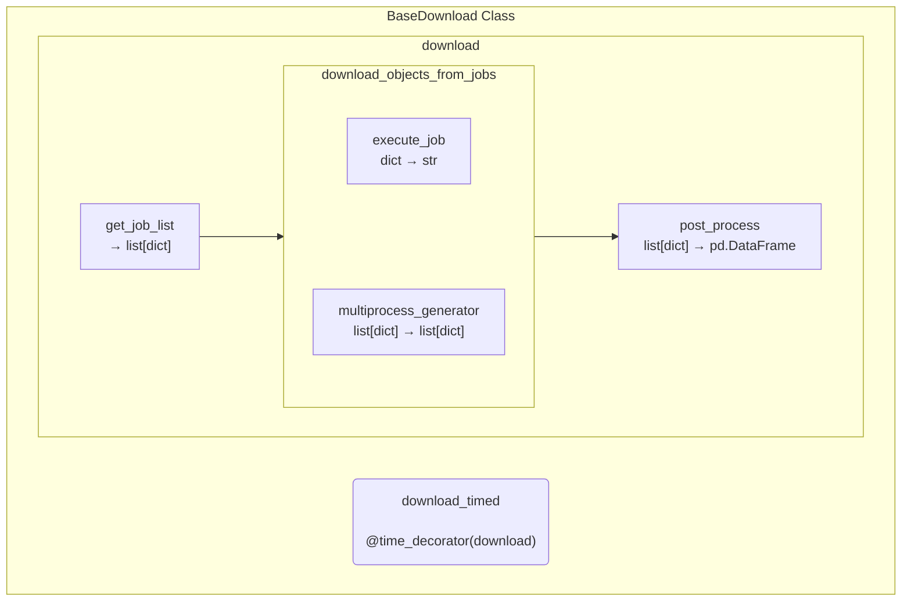
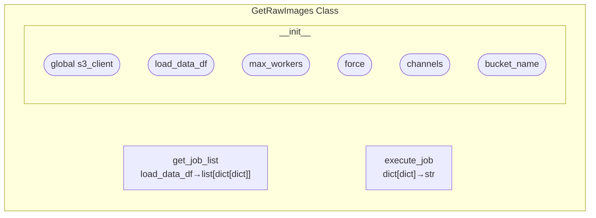
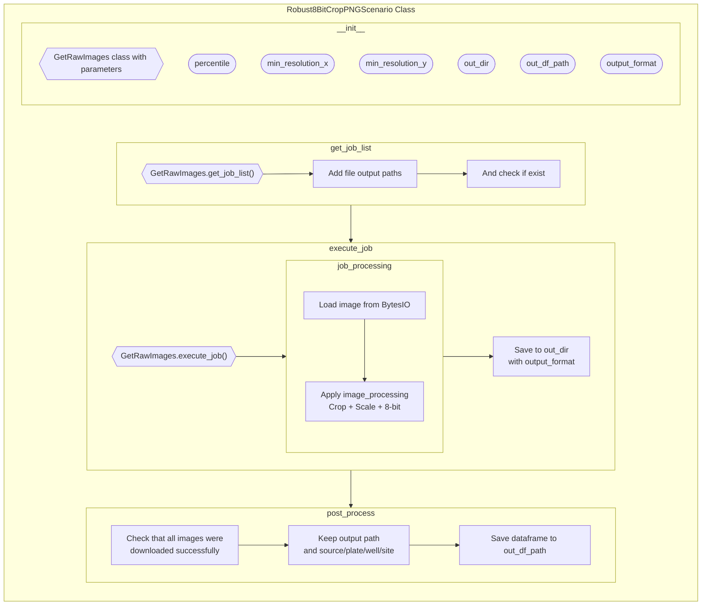

# JUMP Cell Painting dataset download

This is a repository aimed at downloading the JUMP Cell Painting dataset, which is a large dataset of molecule/image pairs obtained using High Content Screening, and can be used to predict molecular properties from images, and vice versa.
The data can then be used to train downstream deep learning models.

The data follows the Cell Painting protocol, a common effort between multiple labs that contains more than 116k tested compound for a equivalent of more that 3M images.

This repository was created once the code was cleaned, the entire Git history is still available on another private repo.

## :blue_book: Citation

We used the JUMP Cell Painting datasets (Chandrasekaran et al., 2023), available from the Cell Painting Gallery on the Registry of Open Data on AWS [https://registry.opendata.aws/cellpainting-gallery/](https://registry.opendata.aws/cellpainting-gallery/).

> Chandrasekaran, S. N., Ackerman, J., Alix, E., Ando, D. M., Arevalo, J., Bennion, M., ... & Carpenter, A. E. (2023).
> JUMP Cell Painting dataset: morphological impact of 136,000 chemical and genetic perturbations. bioRxiv, 2023-03: 2023-03.
> doi:10.1101/2023.03.23.534023

## Resulting file structure

```bash
jump
├── images
│   ├── source_1
│   │   ├── Batch1_20221004
│   │   │   ├── UL001641
│   │   │   │   ├── source_1__UL001641__A02__1__AGP.png
│   │   │   │   ├── source_1__UL001641__A02__1__DNA.png
│   │   │   │   ├── source_1__UL001641__A02__1__ER.png
│   │   │   │   ├── source_1__UL001641__A02__1__Mito.png
│   │   │   │   ├── source_1__UL001641__A02__1__RNA.png
│   │   │   │   ├── source_1__UL001641__A02__2__AGP.png
│   │   │   │   ├── source_1__UL001641__A02__2__DNA.png
│   │   │   │   ├── source_1__UL001641__A02__2__ER.png
│   │   │   │   ├── source_1__UL001641__A02__2__Mito.png
│   │   │   │   ├── source_1__UL001641__A02__2__RNA.png
│   │   │   │   └── ...
│   │   │   └── ...
│   │   └── ...
│   ├── source_13
│   ├── source_4
│   └── source_9
├── jobs
│   ├── ids
│   ├── submission.csv
│   ├── submissions_left.csv
│   └── test_submission.csv
├── load_data
│   ├── check
│   ├── final
│   ├── load_data_with_metadata
│   ├── load_data_with_samples
│   ├── total_illum.csv.gz
│   └── total_load_data.csv.gz
├── metadata
│   ├── complete_metadata.csv
│   ├── compound.csv
│   ├── compound.csv.gz
│   ├── crispr.csv
│   ├── crispr.csv.gz
│   ├── JUMP-Target-1_compound_metadata.tsv
│   ├── JUMP-Target-1_compound_platemap.tsv
│   ├── JUMP-Target-1_crispr_metadata.tsv
│   ├── JUMP-Target-1_crispr_platemap.tsv
│   ├── JUMP-Target-1_orf_metadata.tsv
│   ├── JUMP-Target-1_orf_platemap.tsv
│   ├── JUMP-Target-2_compound_metadata.tsv
│   ├── JUMP-Target-2_compound_platemap.tsv
│   ├── microscope_config.csv
│   ├── microscope_filter.csv
│   ├── orf.csv
│   ├── orf.csv.gz
│   ├── plate.csv
│   ├── plate.csv.gz
│   ├── README.md
│   ├── resolution.csv
│   ├── well.csv
│   └── well.csv.gz
└── README.md
```

The most important files and folders are:

* `images`: a folder containing images from the dataset, organized by source, batch and plate
* `metadata`: a folder containing metadata about the perturbations
  * `metadata/complete_metadata.csv`: a file containing all the well-level metadata for the dataset. It is the merge of the following dataframes:
    * `metadata/plate.csv`: a file containing a list of all plates in the dataset
    * `metadata/well.csv`: a file containing a list of all wells in the dataset, with their corresponding plate and perturbation ID
    * `metadata/compound.csv`: a file containing a list of all compound perturbations
    * `metadata/crispr.csv`: a file containing a list of all CRISPR perturbations
    * `metadata/orf.csv`: a file containing a list of all ORF perturbations
* `load_data`: a folder containing the path to the images both locally and in the s3 bucket
  * `load_data/load_data_with_samples`: a parquet dataframe (partitionned by source) containing the path to the images in the s3 bucket, as well as the filter column, indicating whether the image is kept or not in the local dataset
  * `load_data/final`: a parquet dataframe (partitionned by plate) containing the path to the images locally. It only contains the images that are kept in the local dataset and doesn't include any metadata
* `jobs`: a folder containing the jobs used with HTCondor

## Notes

I recommend using the `load_data/final` parquet dataframe to get a list of all the images downloaded on disk.
Then, you can use the `metadata/complete_metadata.csv` file to get the metadata for each image and merge it with the `load_data/final` dataframe, on the source, plate and well columns.

A line of the `load_data/final` dataframe is equivalent to a "site" of a well, there are around 6 sites per well.
And a site is constituted of 5 images, one for each channel.
A line therefore corresponds to 5 images, one for each channel, in the columns `FilePath_Orig{DNA,AGP,ER,Mito,RNA}` and the columns `Metadata_{Source,Batch,Plate,Well,Site}` contain the metadata for the site.

The `load_data/load_data_with_samples` can be used if you want to look at the images that were not included in the local dataset.

The `jobs` folder is totally useless after the dataset has been downloaded.

## :hammer_and_wrench: Installation

Clone the code from GitHub:

```bash
git clone https://github.com/gwatkinson/jump_download.git
cd jump_download
```

Use [Poetry](https://python-poetry.org/docs/#installation) to install the Python dependencies (via pip). This command creates an environment in a default location (in `~/.cache/pypoetry/virtualenvs/`). You can create and activate an environment, poetry will then install the dependencies in that environment:

```bash
poetry install --without dev            # Install the dependencies

POETRY_ENV=$(poetry env info --path)    # Get the path of the environment
source "$POETRY_ENV/bin/activate"       # Activate the environment
```

## :page_facing_up: Configuration

This project uses [hydra](https://hydra.cc/docs/intro/) to manage the configuration files. The configuration files are located in the [`conf`](https://github.com/gwatkinson/jump_download/conf) folder.

There are 4 groups of configuration files:

* output_dirs: The output directories for the metadata, load data, jobs and images.
* filters: The filters to apply to the images, in order to reduce the number of images to download at source, plate and well level.
* processing: The processing to apply to the images during the download. This points to the main download class (that can be changed to modify the processing).
* run: The parameters related to the download script, such as the number of workers, whether to force the download, etc...

You can create new config files in each group, either by creating a new one from scratch or by overriding some options from the default config files.

### Default configuration

By default, the file used to define the default groups is the `conf/config.yaml` file.

```yaml
defaults:
  - output_dirs: output_dirs_default    # Default output_dirs group (defined in conf/output_dirs/output_dirs_default.yaml)
  - filters: filters_default            # Default filters group (defined in conf/filters/filters_default.yaml)
  - processing: processing_default      # Default processing group (defined in conf/processing/processing_default.yaml)
  - run: run_default                    # Default run group (defined in conf/run/run_default.yaml)
```

To change the default, you can either change the `conf/config.yaml` file so that it points to newly defined groups, change the default config of each group directly, or create a new root config and pass it to the commands with the `-cn` (or `--config-name`) argument.

See the [local config](https://github.com/gwatkinson/jump_download/blob/main/conf/local_config.yaml) for an example of a secondary config.

## :arrow_forward: Quickstart

The `download_example_script.sh` script is an example of the commands needed to download the data. You probably should not use it as is, but rather copy the commands you need from it or create your own script.

```bash
# This script runs the commands in sequence to download the metadata and data files

CONF_NAME=$1
JOB_PATH=$2

echo "Downloading metadata and data files using the configuration file: $CONF_NAME"

echo "Creating Poetry environment"
poetry install --without dev            # Install the dependencies
POETRY_ENV=$(poetry env info --path)    # Get the path of the environment
source "$POETRY_ENV/bin/activate"       # Activate the environment

echo "Downloading metadata files"
download_metadata -cn $CONF_NAME

echo "Downloading load data files"
download_load_data_files -cn $CONF_NAME

echo "Filtering and sampling images to download"
create_job_split -cn $CONF_NAME

echo "Downloading images using job in $JOB_PATH"
download_images_from_job -cn $CONF_NAME run.job_path=$JOB_PATH

# Or use the sub file
# condor_submit ./jump_download/condor/submit.sub

```

## :memo: Usage

### Setup the metadata

First, the metadata for the JUMP cpg0016 dataset can be found on [github.com/jump-cellpainting/datasets](https://github.com/jump-cellpainting/datasets/tree/main/metadata). The script `download_metadata` (defined with poetry) gets the metadata and does some light processing (merge, ...):

```bash
download_metadata  # -h to see help
```

The main parameters that can be changed in the `output_dirs` group are:

```yaml
metadata_dir
metadata_download_script
```

### Get the "load data" files from S3

Then, we need the load data files from the [S3 bucket](https://registry.opendata.aws/cellpainting-gallery/) (see [here](https://cellpainting-gallery.s3.amazonaws.com/index.html#cpg0016-jump/) to explore the bucket).

Those file contains the urls to download the images on S3 and are used to make the link with the metadata (merging by source, batch, plate and well).

This downloads all the load data files (around 216MB compressed but 11GB to download) and does some processing on it (merge the metadata, etc...)
resulting in a directory containing parquet files called `/projects/cpjump1/jump/load_data/load_data_with_metadata` by default:

```bash
download_load_data_files
```

The main parameters that can be changed are:

```yaml
load_data_dir
metadata_dir   # Relies on the metadata downloaded in the previous step
```

### Create the job files

This is the next step, where we create the csv that are used to run the jobs on condor. This step also samples observations given rules set in the config.

Run the following command to create the job files:

```bash
create_job_split
```

This script uses the `load_data_with_metadata` dataframe to create the job files.
It samples a number of images per well and applies source and plate level filters as well.

The output is a directory called `/projects/cpjump1/jump/jobs` by default.
It contains a `ids` folder with around 2100 parquet file that are all equivalent to one plate.
They have a similar format to the `load_data_with_metadata` dataframe but with only the selected observations, and with the additional columns:

* `output_dir`: The directory where the images will be downloaded for that job
* `filter`: Whether the observation was filtered out or not (this should always be `True` as only the selected observations are kept)
* `job_id`: The id of the job (equivalent to the name of the csv file), the form is `{source}__{batch}__{plate}`

The function giving the `output_dir` and `job_id` are **hard coded** in the [`sample_load_data.py`](https://github.com/gwatkinson/jump_download/blob/main/jump_download/create_jobs/sample_load_data.py) file. To modify the output paths you should change the functions [`create_output_dir_column`](https://github.com/gwatkinson/jump_download/blob/main/jump_download/create_jobs/sample_load_data.py#L288) and [`create_job_id_column`](https://github.com/gwatkinson/jump_download/blob/main/jump_download/create_jobs/sample_load_data.py#L302).

The main parameters that can be changed are:

```yaml
load_data_dir         # Relies on the load data downloaded in the previous step
job_output_dir        # The directory where the job files will be saved
source_to_disk        # The mapping from source to disk (this is used to create the output_dir column)
plate_types_to_keep   # The plate types to keep (this is used to filter images)
sources_to_exclude    # The sources to exclude
# The number of observations to keep per well for each type of plate
{compound/orf/crispr/target}_number_of_{poscon/negcon/trt}_to_keep_per_well
```

The resulting folder structure is:

```bash
* load_data/jobs/
  * ids/
    * {plate}__{batch}__{source}.parquet  # The job files, one per plate, and the dropped images are not included
  * submission.csv                        # The csv file that contain the path to all the job files that should not be dropped
```

The original load_data file is split into many subfiles in order to use them with Condor.
If you prefer downloading all the images at once, you can just use the `load_data/jobs/ids` parquet directory directly, which can loaded directly with pandas as a single dataframe.

### Download the images

Finally, the images can be downloaded using the following command:

```bash
download_images_from_csv run.job_path=<PATH>
```

`<PATH>` can be the path to a single parquet job file, or the directory containing all the job files (in which case all the job files will be downloaded).

The important parameters are:

```yaml
download_class:
    _target_: jump_download.images.final_image_class.Robust8BitCropPNGScenario  # Points to the main download class
    percentile: 1.0         # Arguments passed to the download class
    min_resolution_x: 768
    min_resolution_y: 768
```

This script uses the [`Robust8BitCropPNGScenario`](https://github.com/gwatkinson/jump_download/blob/main/jump_download/images/final_image_class.py#128).
It can be modified to use different parameters, or to use a different scenario.

#### Details on the download class

The main class used to download and apply the processing to the images is the `Robust8BitCropPNGScenario` class.
It inherits from the `BaseDownload` class, which is a class that defines a framework to run a function on a list of jobs. The code is in the `jump_download/base_class.py` file.

##### BaseDownload Class

The BaseDownload class is the abstract class that define a framework to download the data. The code is in the `download/base_class.py` file, and is used in the `images` and `load_data_files` modules.



The `get_job_list`, `execute_job` and `post_process` methods are abstract, and need to be implemented in the child class.

##### GetRawImages Class

From there, the `GetRawImages` class is a child class of the `BaseDownload` class. It is used to download the raw images from the S3 bucket.

It has the following structure:



It implements the `get_job_list` and `execute_job` methods. The jobs are dictionaries with the following structure :

* source: Information on the image
* batch
* plate
* well
* the 5 channels as keys, the value being a sub dictionary :
  * channel: the name of the channel (duplicate)
  * s3_filename: the name of the file on the S3 bucket (Key for boto3)
  * bucket_name: the name of the bucket (Bucket for boto3)
  * buffer: the BytesIO object empty

The `execute_job` method uses the `download_fileobj` from boto3 to add the bytes object to the job dictionaries.

##### Robust8BitCropPNGScenario Class

Finally, the `Robust8BitCropPNG` class is a child class of the `GetRawImages` class. It is used to download the raw images from the S3 bucket, and then process them to create the 8-bit PNG images.



You can create your own class by inheriting from the `BaseDownload` class, and implementing the `get_job_list`, `execute_job` and `post_process` methods. It requires the following arguments:

* load_data_df: The path to the load data dataframe (defined in the config files)
* out_dir: The path to the output directory (usually the folder where the images will be saved, defined in the config)
* out_df_path: The path to the resulting dataframe
* max_workers: The number of workers to use for the multiprocessing (passed to the BaseDownload class)
* force: Whether to force the download of the images, even if they already exist

If you create your own class, you will also probably need to modify the `main` function in the `jump_download/images/final_image_class.py` module.
If you recreate it, the required arguments listed above are not mandatory (do as you wish).

### Run the jobs on the cluster with Condor

This is the last step of the pipeline. It uses the `download_plate` command to download the images from the S3 bucket.

It consists only of a single `.sub` file that tells how much ressources should be used, and how many jobs should be run in parallel on different nodes.

```bash
condor_submit jump_download/condor/submit.sub
```

This requires some of the previous steps, namely:

```bash
download_metadata
download_load_data_files
create_job_split
```

This step can be ignored if you are not using HTCondor.
However, if you use it, **change the content of the `submit.sub`** file to match your needs.

```python
# 1 - Describes the working directory of the job.
InitialDir              = <path/to/project>
request_cpus            = 8
request_memory          = 2GB
MY.MaxThreads           = 64
accounting_group        = LongJob.Weekly
MY.Limit                = (10000 / $(MY.MaxThreads)) * $(request_cpus)
concurrency_limits_expr = StrCat(MY.Owner,"_limit:", $(MY.Limit))


# 2 - Describes the program and arguments to be instantiated.
executable              = <path/to/project>/jump_download/condor/download_plate.sh
arguments               = $(job_csv_file) $(request_cpus)


# 3 - Describes the output files of the job.
output                  = <path/to/log/folder>/$(Cluster)-$(Process).output
error                   = <path/to/log/folder>/$(Cluster)-$(Process).error
log                     = <path/to/log/folder>/$(Cluster)-$(Process).log
stream_output           = True
stream_error            = True

notify_user             = <email>
notification            = Complete


#  - Insert this job into the queue!
queue job_csv_file from <path/to/load_data_dir>/jobs/submission.csv
```
