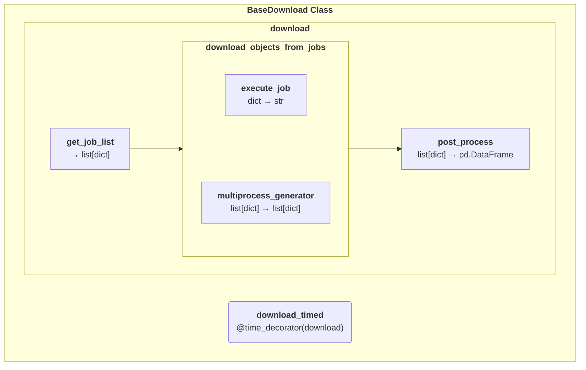
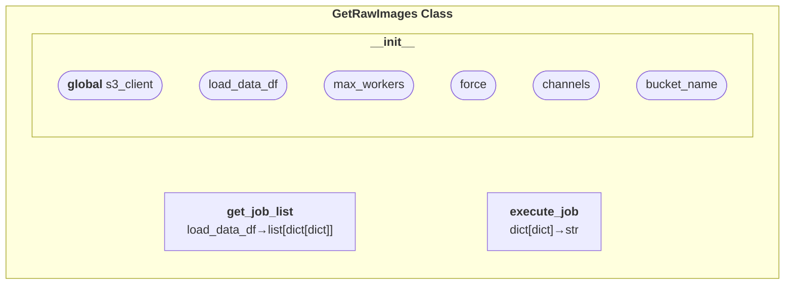
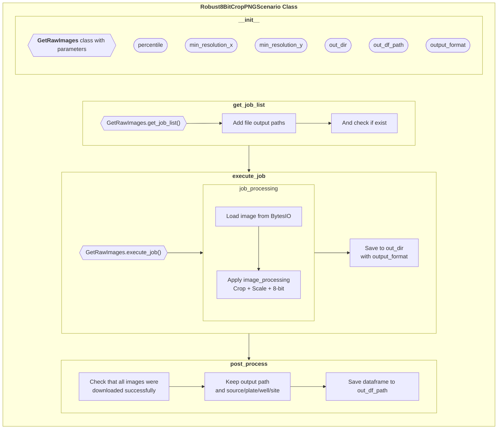

# Download the images

Finally, the images can be downloaded using the following command:

```bash
download_plate --job_csv_path PATH
```

By default, the command uses the values defined in the `constants.py` file. The important parameters are:

```python
LOAD_DATA_DIR = os.path.join(DATA_ROOT_DIR, "load_data")
MAX_WORKERS = 8  # The maximum number of workers to use for multiprocessing
PERCENTILE = 1.0  # The percentile to use to normalize the images (1.0 = 99th percentile)
MIN_X = 768  # The crop size in the x and y directions. Note that the crop is centered, and if this value is larger than the image size,
MIN_Y = 768  # the image is not cropped. To keep the original size, you can set this value to 2000 (bigger than the largest image size)
```

This script uses the [`PNGCompressionScenario`](https://github.com/gwatkinson/mice/blob/main/mice/download/images/download_images.py#L350).
It can be modified to use different parameters, or to use a different scenario.

The `--remove_tmp` flag is important, as it allows to remove the raw file after the images have been processed.

## Usage

```bash
Usage: download_plate [OPTIONS]

  Download images from the S3 bucket given a scenario and a load data file.

  Args:
    job_csv_path (str): Path to the job.csv.gz file defined in the previous step
    tmp_out_dir (str): Path to the temporary image directory
    load_data_out_dir (str): Path to the directory containing the temporary images
    percentile (float): Percentile to use for the scaling function
    min_resolution_x (int): Minimum resolution in the x direction for the cropping function
    min_resolution_y (int): Minimum resolution in the y direction for the cropping function
    max_workers (int): Maximum number of workers to use
    remove_tmp (bool): Remove the temporary files from the tmp_out_dir
    force (bool): Whether to run the job even if the output file already exists
    channels (list): Channels to download
    bucket_name (str): Name of the bucket to download from

Options:
  --job_csv_path PATH             Path to the job.csv.gz file  [required]
  --load_data_out_dir TEXT        Path to the directory containing the
                                  load_data output
                                  [default: /projects/cpjump1/jump/load_data]
  --percentile FLOAT              Percentile to use for the scaling function
                                  [default: 1.0]
  --min_resolution_x INTEGER      Minimum resolution in the x direction
                                  [default: 768]
  --min_resolution_y INTEGER      Minimum resolution in the y direction
                                  [default: 768]
  --max_workers INTEGER           Maximum number of workers to use
                                  [default: 8]
  --remove_tmp / --no_remove_tmp  Remove the temporary files
                                  [default: remove_tmp]
  --force / --no_force            Force overwrite of existing files
                                  [default: no_force]
  --channels TEXT                 Channels to download
                                  [default: DNA, AGP, ER, Mito, RNA]
  --bucket_name TEXT              Name of the bucket to download from
                                  [default: cellpainting-gallery]
  -h, --help                      Show this message and exit.
```

## BaseDownload Class

The BaseDownload class is the abstract class that define a framework to download the data. The code is in the `download/base_class.py` file, and is used in the `images` and `load_data_files` modules.

It is composed of the following methods:



The `get_job_list`, `execute_job` and `post_process` methods are abstract, and need to be implemented in the child class.

## GetRawImages Class



The `GetRawImages` class is a child class of the `BaseDownload` class. It is used to download the raw images from the S3 bucket.

It implements the `get_job_list` and `execute_job` methods. The jobs are dictionaries with the following structure :

* source: Information on the image
* batch
* plate
* well
* the 5 channels as keys, the value being a sub dictionary :
  * channel: the name of the channel (duplicate)
  * s3_filename: the name of the file on the S3 bucket (Key for boto3)
  * bucket_name: the name of the bucket (Bucket for boto3)
  * buffer: the BytesIO object empty

The `execute_job` method uses the `download_fileobj` from boto3 to add the bytes object to the job dictionaries.

## Robust8BitCropPNG Class



Finally, the `Robust8BitCropPNG` class is a child class of the `GetRawImages` class. It is used to download the raw images from the S3 bucket, and then process them to create the 8-bit PNG images.
